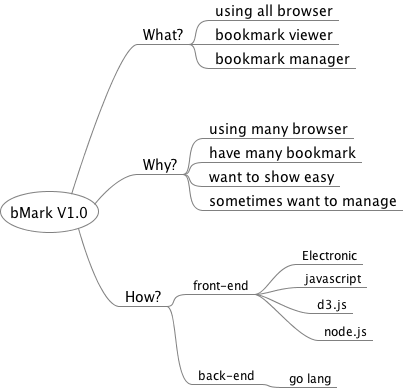

## bMarks

- All Browser management tool

## What?
- I hope that it show all browser bookmarks and manage it for users.

## Why?
- Many people are using many different browser.
- Many people have many bookmarks.
- I want to show and view easy.
- I want to manage bookmarks.

## How?

### front-end
- Electronic
- javascript
- sometimes node.js

### back-end
- golang.
- sqlite or somethings database.

